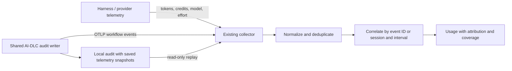

# Proposal: correlate native consumption with AI-DLC audit events

Status: proposed, with an implementation and reference consumer in this change.

## Problem and intended behavior

AI-DLC v2 records the workflow's stages, units, decisions, and sessions. Its
existing local consumption producer reads Claude Code transcripts. That
producer does not provide portable consumption tracking for other harnesses,
and audit counters alone cannot answer how many tokens or credits a stage used.

Keep consumption measurement with the harness, provider, or an existing
telemetry pipeline. Add one shared AI-DLC audit exporter so those measurements
can be correlated with workflow events. This gives every harness the same
workflow-side contract without adding a transcript parser for each host.

For example, a native request reports 100 input tokens, 50 output tokens, its
model, and its session ID. AI-DLC independently records a Code Generation start
and completion for that session. A consumer preserves those measured values
and reports a **stage-window** association if the request interval lies inside
one unambiguous completed stage. It does not turn the agent's configured model
or effort into a claim about the request's actual configuration.

## Ownership



| Component | Owns |
|-----------|------|
| Harness/provider | Measured tokens, cache/reasoning breakdowns, billable units, actual model, reported effort, request/response IDs and times |
| Existing collector | Native export setup, identity namespace, schema normalization, retention and delivery |
| AI-DLC | Audit event identity, event time, native session association, intent, stage, unit, attempt generation and configured model/effort snapshot |
| Consumer | Deduplication, attribution confidence, missing-data coverage, unit-aware aggregation |

AI-DLC does not install or configure native telemetry. A harness that does not
report a quantity leaves that quantity unavailable. There is no universal
token-to-credit conversion. A model's reasoning-token count also does not
establish its effort setting.

## Implementation in this change

- `core/tools/aidlc-telemetry.ts` captures allowlisted metadata and sends
  OTLP/HTTP JSON logs to an explicitly configured endpoint.
- `core/tools/aidlc-audit.ts` snapshots metadata before a structured append and
  exports it after the append succeeds. This covers single writes, batches,
  explicit shard writes, and fork/merge receipts.
- `aidlc engine audit export` prints saved telemetry for the active intent,
  using the existing read-only audit reader. Its output is an OTLP request body.
- `scripts/telemetry-correlate.ts` is a reference consumer for a saved audit
  export plus normalized native usage. It demonstrates deduplication and
  conservative event/stage association without reading any harness files.

No new audit event type or approval authority is introduced. `Telemetry` is
an optional, emitter-owned field on an existing audit row, not a gate receipt.
The existing Claude usage ledger and StatsD exporter remain independent.
The new audit export does not include their rolled-up consumption fields:
combining rollups and native requests would count consumption twice.

## Configuration

The feature is disabled by default. Nothing is sent and no telemetry snapshot
is added unless one of these opt-ins is present in the AI-DLC tool environment.

| Variable | Meaning |
|----------|---------|
| `AIDLC_AUDIT_TELEMETRY=1` | Save correlation snapshots locally without requiring a collector |
| `AIDLC_OTEL_ENDPOINT` | Full OTLP/HTTP **logs** URL, such as `http://127.0.0.1:4318/v1/logs`; also enables snapshots |
| `AIDLC_OTEL_HEADERS` | Optional HTTP headers, one `Header-Name: value` per line |

The endpoint is used exactly as supplied; `/v1/logs` is not appended. This
sender uses JSON over HTTP, not gRPC or protobuf. Standard
`OTEL_EXPORTER_OTLP_*` variables are not consumed implicitly: configuring
native harness telemetry alone must not opt AI-DLC into another data export.
AI-DLC's existing offline setting suppresses delivery while retaining local
snapshots. Remove both opt-ins to stop future capture and delivery.

Example for a local collector:

```sh
export AIDLC_OTEL_ENDPOINT=http://127.0.0.1:4318/v1/logs
# Start the coding harness from this environment, then run AI-DLC normally.
```

Native harness telemetry must separately reach the same telemetry system.
Normalize its native `session.id` / `conversation.id` equivalents to
`gen_ai.conversation.id` without replacing the native value. An IDE must
propagate the configuration to its tool processes; setting a variable in an
unrelated terminal does not configure an already-running IDE.

## Version 1 audit contract

The resource is `service.name=aidlc`; the instrumentation scope is
`aidlc.audit`, version `1`. Each log's body is the existing audit event type.
Severity is informational. `timeUnixNano` is a decimal string as required by
OTLP's JSON encoding. Its underlying clock has millisecond resolution;
nanosecond units do not imply nanosecond precision or causal ordering.

| Attribute | Meaning |
|-----------|---------|
| `aidlc.telemetry.schema.version` | `1` |
| `aidlc.audit.event.id` | UUID minted once and persisted with the audit row |
| `aidlc.audit.timestamp` | Existing audit timestamp, preserved separately |
| `aidlc.version` | AI-DLC version that captured this event |
| `aidlc.harness.name` | AI-DLC distribution name |
| `aidlc.record.kind` | `intent`, `space`, or `unknown` |
| `aidlc.record.path` | Project-relative record directory when recognized |
| `aidlc.space.name` | Space from the actual destination shard |
| `aidlc.intent.id` | Registry UUID when available; absent for space-level records |
| `gen_ai.conversation.id` | Native session ID from the event or invoking process |
| `aidlc.session.source` | `event`, `invoking-session`, or `unavailable` |
| `aidlc.stage.name`, `aidlc.phase.name`, `aidlc.unit.name`, `aidlc.agent.name`, `aidlc.scope.name` | Present only when the event supplies the identifier |
| `aidlc.workflow.kind`, `aidlc.attempt.generation` | Existing event scope, when present |
| `aidlc.model.configured`, `aidlc.effort.configured` | Resolved AI-DLC agent policy at event time, when expressible |
| `aidlc.model.policy.layer`, `aidlc.model.policy.status` | Policy provenance and availability |

Identifiers are bounded and single-line. Free-form details, questions, answers,
prompts, artifact contents, absolute project paths, usernames, hostnames,
credentials and existing usage rollups are not exported by this producer.
Project-relative record names and identifiers are still metadata shared with
the chosen collector.

The exporter uses the **actual destination shard** for record identity. A
space-level document event cannot inherit a currently selected intent. It uses
existing session resolution and never the shared last-active-session pointer.
An explicit invalid session or conflicting session evidence remains
unattributed. It does not attach made-up trace/span IDs or mistake an AI-DLC
review request ID for a provider request ID.

The metadata is a historical snapshot. Replay does not consult current model
settings, invent an ID for a legacy row, or borrow the session running export.
Neither configured model aliases nor `inherit` values establish the model
that actually served a request. Actual model and reported effort stay on the
native usage record.

## Delivery, replay, and duplication

The sender runs in an unreferenced child using the same Bun module or installed
binary. A batch uses one request. The audit caller does not await the network.
Endpoint and custom headers travel through stdin and are removed from the
worker environment. Redirects are not followed; each HTTP attempt has a
three-second timeout.

Delivery is best effort. Collector failure, timeout, spawn failure, partial
acceptance, or process termination cannot invalidate an audit write.
There is no acknowledgment ledger, automatic retry queue, or exactly-once
promise in this first change. Operators can replay captured intent events:

```sh
aidlc engine audit export > audit-otlp.json
curl --fail-with-body \
  -H 'Content-Type: application/json' \
  --data-binary @audit-otlp.json \
  http://127.0.0.1:4318/v1/logs
```

The export command itself performs no network request or write. It requires a
readable active intent, exports its captured structured events, and skips
legacy rows, free-form notes, and unsupported or malformed snapshots.
Space-level snapshots can be delivered live; the first CLI replay command is
scoped to the active intent. Complete workspace/space replay and delivery
receipts are follow-up work.

A copied fork/merge event retains its ID. Replay deduplicates identical copies
and refuses conflicting snapshots sharing an ID. A collector or downstream
store must also deduplicate by identity namespace and `aidlc.audit.event.id`
before analysis: ordinary OTLP delivery alone is not a deduplication service.
Native consumption needs its own stable source-record key.

## Correlation and normalized consumption

Preserve request-level or interval-level usage, including source event ID,
native session ID, harness, event timestamps, delta/cumulative semantics,
reported model/effort and units. Daily totals and session-only summaries
cannot support precise stage attribution. Preserve cache semantics and keep
cache/reasoning breakdowns separate where they are already included in another
counter.

For fleet use, perform joins within the collector's trusted tenant/source
identity namespace. A session ID is a correlation label, not authentication.
The reference consumer takes one intent export and usage from that same
identity namespace. It accepts this normalized JSON shape:

```json
{
  "schemaVersion": 1,
  "records": [
    {
      "id": "source-event-0001",
      "harness": "codex",
      "sessionId": "native-session-id",
      "startedAt": "2026-10-06T12:00:02.000Z",
      "endedAt": "2026-10-06T12:00:03.000Z",
      "temporality": "delta",
      "model": "reported-model-id",
      "effort": "high",
      "quantities": [
        { "name": "input", "value": 100, "unit": "token" },
        { "name": "output", "value": 50, "unit": "token" },
        { "name": "cache_read", "value": null, "unit": "token" }
      ]
    }
  ]
}
```

`sessionId`, `startedAt`, and `endedAt` are nullable; model and effort are
optional. A provider billing unit can be represented as, for example,
`{"name":"billable","value":0.25,"unit":"credit"}`. The input is a contract for
the existing collector's normalization layer, not a new native harness format.
A record ID must uniquely identify that source record within the harness and
identity namespace; a request ID shared by several distinct metric records is
insufficient by itself.

```sh
bun scripts/telemetry-correlate.ts audit-otlp.json usage.json > correlated.json
```

The script preserves measured quantities and emits one of:

| Match | Rule |
|-------|------|
| `event-id` | Native/collector record explicitly carries `auditEventId`; the event exists and harness/session evidence does not conflict |
| `stage-window` | The entire delta interval lies strictly inside one completed stage window with matching harness/session, intent, stage, unit, workflow kind and attempt generation |
| `unattributed` | Missing keys/times, synthetic unmatched IDs, cumulative records, open stages, boundary timestamps, crossing intervals, or overlapping candidates |

A **stage-window match is an inference**, not an exact request-to-stage trace.
Start/completion rows must agree on scope. Concurrent or partially overlapping
stages, including unfinished stages, prevent an exclusive match. Late
telemetry uses event time rather than ingestion time. The start event's ID is
the inferred attempt reference; no new mutable stage-attempt counter is needed.
An explicit event link that fails validation does not fall back to a time guess.

The reference deliberately leaves cumulative readings unattributed. A
collector that converts a cumulative counter to deltas must handle resets,
duplicates, ordering and measurement intervals before claiming stage usage.
Session-only credit summaries and wrapper-generated IDs remain useful for
coarser totals, but cannot be silently allocated across stages. Subagent usage
with a different native session likewise needs an explicit parent/request
association from its source before it can inherit a parent workflow.

Reports should show counts/quantities by attribution class and source coverage,
keep unknowns distinct from zero, and aggregate only compatible metric/unit
pairs. They must not add stage totals to workflow totals or native requests to
the existing Claude audit rollups.

## Compatibility and rollout

All seven distributions package the same exporter. No harness adapter changes
are required for the workflow side. Native telemetry support and exporter
configuration remain source capabilities: this feature does not create token
or credit APIs where a harness exposes none.

The versioned contract absorbs changes on the AI-DLC side. Unknown optional
attributes are ignored; an unsupported major schema is not reinterpreted.
The collector still owns mappings for the native telemetry formats it
supports. Documented native interfaces reduce upgrade risk, but cannot
eliminate it. A broken/missing mapping should reduce reported coverage rather
than produce zero usage or guessed attribution.

Roll out local snapshots first, then connect a local collector, compare
captured event IDs to stored records, and enable downstream joins. Verify
native session IDs match before enabling stage reports. Keep the existing
pipeline's retention, identity and access controls.

Tests cover the shared append paths, default-off behavior, replay identity,
session isolation, explicit space shards, policy provenance, all generated
harnesses, source and compiled transport, collector rejection, malformed
schemas, duplicate/conflicting records, interval overlap and unknown usage.

## Public references

- [OTLP specification](https://opentelemetry.io/docs/specs/otlp/)
- [OpenTelemetry logs data model](https://opentelemetry.io/docs/specs/otel/logs/data-model/)
- [GenAI attribute registry](https://opentelemetry.io/docs/specs/semconv/registry/attributes/gen-ai/)
- [Existing usage tracking and metrics](../reference/06-hooks-and-tools.md#token-usage-and-cost-tracking)
